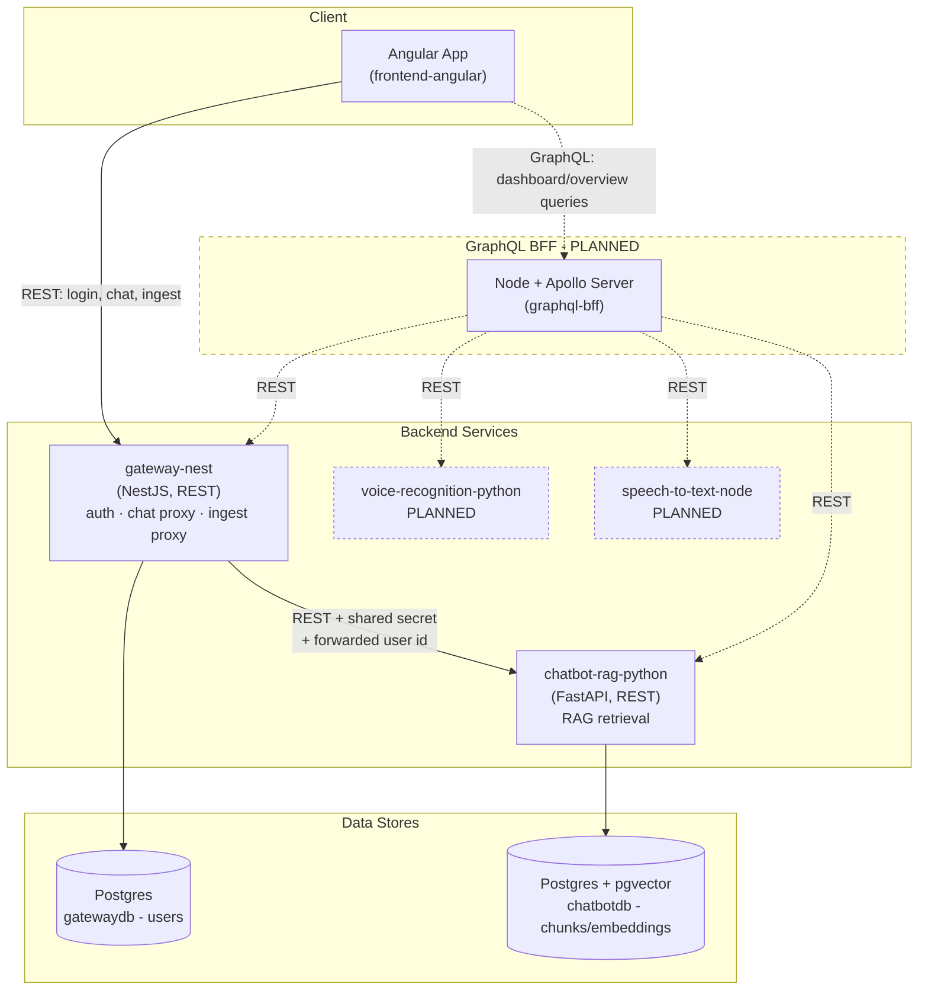

# Architecture

How the services in this repo talk to each other today, and how the
planned GraphQL BFF layer fits in once it's built.

## Two call patterns, side by side

This system intentionally uses **two different patterns** for two
different kinds of client needs, not one pattern for everything:

- **Direct REST** (exists today) - for single-purpose actions: log in,
  send a chat message, ingest a document. Angular calls `gateway-nest`
  directly; `gateway-nest` calls the Python service it needs. Fast,
  simple, one clear owner per request.
- **GraphQL BFF** (planned) - for read-heavy views that need data
  *composed* from multiple services at once, e.g. a dashboard overview
  showing document counts, recent chat activity, and voice transcription
  history together. Angular sends one GraphQL query; the BFF fans out to
  whichever services hold the pieces and returns one combined response.

Nothing about the REST paths changes when the GraphQL layer is added -
it sits alongside them, not in front of them.

## Diagram



Solid arrows = built and working today. Dashed arrows/boxes = planned.

## Chat responses: semantic answers vs. structured queries

Not every question a user asks the chatbot is the same *kind* of
question, and `chatbot-rag-python` needs to treat them differently:

- **Semantic questions** ("do we have data from CompanyX?") - answered
  via vector similarity search over chunk embeddings in `chatbotdb`,
  returned as a natural-language reply.
- **Structured queries** ("give me the latest entries", "compare X and
  Y") - answered via a plain relational query against metadata stored
  alongside each chunk at ingestion time (source company, ingested date,
  document type, etc.) - **not** a vector search. Forcing this kind of
  request through similarity search would return semantically-similar
  but factually-wrong results instead of an accurate list.

**Routing between the two (PLANNED):** rule-based to start - simple
keyword/pattern matching (e.g. "latest", "list", "compare" -> structured
query path; everything else -> semantic path). No LLM dependency needed
for this decision yet. This can later evolve into LLM-driven intent
classification/function calling if rule-based matching proves too
rigid - deliberately deferred, since it would mean committing to an LLM
provider (OpenAI/Anthropic/local) earlier than necessary.

**Response shape:** the reply needs to carry more than text so Angular
knows *how* to render it, not just what to say:

```json
{
  "reply": "Here are the 5 most recent entries.",
  "type": "table",
  "data": {
    "columns": ["company", "ingestedAt", "chunks"],
    "rows": [{ "company": "CompanyX", "ingestedAt": "2026-07-20", "chunks": 42 }]
  },
  "suggestions": [
    { "label": "View as chart", "type": "chart" },
    { "label": "Compare with last month", "type": "comparison" }
  ]
}
```

- `type` is drawn from a **predefined, extensible enum** - not a
  free-form string. Starting set: `text | table | chart | list |
  comparison`. Add more as real use cases show up, rather than
  designing every possible type upfront.
- `suggestions` lets the bot proactively offer follow-up views/actions
  (e.g. "View as chart") instead of the user having to guess what's
  possible.
- `chatbot-rag-python` is the source of truth for which `type` values
  exist; `frontend-angular` needs a matching TypeScript union to switch
  on. Same "keep two languages in sync manually" situation already true
  of the shared internal-API secret (see below) - no compiler check
  across the language boundary, has to be kept in sync by hand.

## Document review before ingestion

**Status: submitter side built and verified end-to-end. Reviewer side
(roles, approve/reject, signing) not started.**

Uploading a document no longer ingests it immediately -
`gateway-nest` used to forward straight to `chatbot-rag-python`'s
`/documents/ingest`, which chunked/embedded/stored in one request.
That's being replaced by a human-in-the-loop flow: a submitter uploads,
a manager reviews and approves each document one by one, and only
approved documents get chunked/embedded. This doesn't change the
REST-vs-GraphQL call pattern above or the Angular -> gateway ->
chatbot-rag-python diagram - it adds a review gate *inside* that same
existing path. `/documents/ingest` (chunk/embed/store) itself is
untouched and still exists - nothing routes to it yet, since approval
is what's supposed to trigger it next.

### Flow

```
submitter uploads  ->  pending review  ->  manager opens/downloads to review
     (built)                                        (not built)
                                    +---------------+---------------+
                                    |                               |
                                 approve                         reject
                            (= signs off, see below)      (status + reason,
                                    |                       no signature)
                              (not built)                   (not built)
                                    v
                        chunk + embed + store
                     (existing /documents/ingest,
                      not yet wired to approval)
```

### Where pending documents live

`pending_document` table on `chatbotdb` (owned by `chatbot-rag-python`,
alongside `document_chunk`) - built, per the reasoning already settled
here (no new infra, Postgres `bytea` is transactional at this file
scale):

```
pending_document
  id                PK
  source_filename   text
  format            text            -- 'pdf' | 'csv'
  content           bytea
  submitted_by      text (user_id)
  status            text            -- 'pending' | 'approved' | 'rejected'
  reviewed_by       text, nullable
  reviewed_at       timestamp, nullable
  rejection_reason  text, nullable
  created_at        timestamp
```

### Endpoints (built so far)

- `chatbot-rag-python`:
  - `POST /documents/submit` - stores the raw upload, `status='pending'`.
  - `GET /documents/mine` - the caller's own rows (metadata only, no
    `content`), scoped server-side by the forwarded `X-User-Id`, newest
    first.
- `gateway-nest` (`DocumentsController`/`DocumentsService`): proxies
  both of the above 1:1, translating the JWT's user id into the
  `X-User-Id` + `X-Internal-Api-Key` headers `chatbot-rag-python`
  expects - same pattern as the existing chat proxy.
- **Not built yet:** a reviewer-facing "list everyone's pending
  documents" endpoint, plus approve/reject endpoints. These need roles
  first (see Open questions).

### Frontend components (`frontend-angular`, under `documents/`)

- **`ingestion-submission-form`** - built. Left column. Format select +
  file picker/dropzone + selected-files list + "Submit for review"
  button, calling `Documents.submit()`. Emits a `submitted` output on
  success so the page can refresh the list beside it without the two
  components needing to know about each other directly.
- **`ingestion-submitted-template`** - built. Right column. The
  *submitter's* view of their own submissions: filename, submitted/
  reviewed dates, a `p-tag` status pill (pending=warn, approved=success,
  rejected=danger), rejection reason inline when rejected. Exposes a
  public `refresh()` so a sibling can trigger a reload.
- **`ingest`** (route host, `/ingest`) - built. Hosts both side by side
  in a two-column grid (`~50/50`, stacks to one column below 760px),
  wires `ingestion-submission-form`'s `submitted` output to
  `ingestion-submitted-template.refresh()` via `viewChild` so a
  successful submit shows up in the list immediately, no page reload.
- **`ingestion-review-template`** - **not built.** The reviewer's
  (manager's) equivalent of the submitted-list: same shape, different
  actions - open for review (preview), download, approve (signs off -
  see below), reject (reason, no signature). Deliberately a separate
  component from `ingestion-submitted-template`, not a mode toggle on
  it, since the actions differ. A correction/edit mechanism is a likely
  future addition here but explicitly deferred.

### Electronic sign-off (not started)

The manager's **approve** action is intended to be the first real use
case for a reusable "sign off an action" component (meant to be reused
elsewhere later, not document-specific by design):

- **Capture vs. key material.** The user performs a drawn signature
  (canvas capture) as the human consent gesture, but that drawing is
  *not* used as cryptographic key material - freehand strokes are
  low-entropy and non-reproducible, so they can't reliably re-derive
  the same key twice. Instead: a proper asymmetric keypair (WebCrypto
  ECDSA P-256, non-extractable private key held client-side) is
  generated once at enrollment; the drawn signature's hash is stored
  alongside it purely as an audit artifact.
- **Reuse pattern.** Any sign-off action anywhere in the app builds a
  canonical descriptor (`{ actionType, resourceId, userId, timestamp }`),
  hashes it, signs the hash with the enrolled key, and the verifying
  side checks it against the stored public key - one mechanism, reused
  per action type, not rebuilt per feature.
- **Per-file, not per-batch.** Approving *is* signing - there's no
  separate "sign off the batch once everything's approved" step.
  Reasoning: a batch-level signature would need to hash a whole set of
  documents together (batch/merkle-style payload) and still couldn't
  prove "was document X approved" without reconstructing the rest of
  the batch. Signing per document keeps each approval independently
  verifiable and avoids an "approved but not yet signed" limbo state.
  Reject does not require a signature - you're not attesting to
  anything by rejecting.

### Open questions

- **Roles.** `User` still has no role (`member` | `manager`) in the
  JWT - this is the actual blocker for everything reviewer-side
  (`ingestion-review-template`, the list-all/approve/reject endpoints).
  Next real slice of work.
- **Where does the signing capability live** - a new dedicated service
  (own DB, same proxy pattern `gateway-nest` already uses for
  `chatbot-rag-python`) vs. a module inside `gateway-nest` reusing its
  existing JWT auth. Not decided yet.
- **Notification mechanism for managers** - v1 is a polling unread-count
  badge in `TopBar`; real-time push (WebSocket/SSE) is a later upgrade,
  not a blocker. Not started.

## Why the BFF doesn't replace the REST paths

Migrating `login`/`chat`/`ingest` to GraphQL would add a schema, a
resolver layer, and a new client library (Apollo Client) for operations
that are already simple, single-service, and imperative - no
over-fetching problem to solve, no multiple clients to serve differently.
The BFF earns its complexity specifically where **composition across
services** is the actual problem: one Angular dashboard query, several
backend sources, assembled server-side instead of the frontend making N
separate REST calls and stitching them together itself.

## How the BFF's resolvers will call REST services

Each GraphQL resolver in `graphql-bff` needs to fetch data from a REST
service (`gateway-nest`, `chatbot-rag-python`, etc.) - the idiomatic way
to do that in Apollo Server is `RESTDataSource`, not hand-rolled
`fetch`/`axios` calls inside resolvers.

`RESTDataSource` is a base class each service's data-fetching logic
extends (e.g. `GatewayAPI extends RESTDataSource`, `ChatbotAPI extends
RESTDataSource`). It gives you:

- A consistent place to set the base URL, headers (auth, the internal
  shared-secret pattern already used between `gateway-nest` and
  `chatbot-rag-python`), and error handling for one backend service.
- **Automatic request deduplication** - if two different resolvers
  resolving the same GraphQL query both ask for the same REST resource,
  it's only fetched once.
- Built-in response caching respecting the REST API's own `Cache-Control`
  headers, without extra code.

Resolvers then depend on these data source classes instead of talking to
`fetch` directly - keeping "how do I reach this REST service" in one
place per service, separate from "how do I shape this GraphQL field."

## Open questions / TODO

Decisions deliberately deferred until there's a real need to make them:

- **Dashboard aggregation query design.** Once the frontend dashboard
  needs data from multiple services at once (documents ingested, chat
  activity, voice/STT history), decide:
  - Which specific fields the dashboard overview actually needs from
    each service (drives the GraphQL schema - ties to the Stat/KPI
    Cards frontend component).
  - How the root resolver composes them - one query fanning out via
    `RESTDataSource` to `gateway-nest` + `chatbot-rag-python` + the
    future voice/STT services.
  - Partial-failure behavior - if one fanned-out service is slow or
    down while assembling the combined response, does the query return
    partial data with a per-field error, or fail the whole request?

## Services in this repo

| Service | Role | Status |
|---|---|---|
| `frontend-angular` | Angular + PrimeNG UI | In progress |
| `gateway-nest` | Auth, session, REST proxy to Python services | In progress |
| `chatbot-rag-python` | RAG retrieval over ingested documents (pgvector) | In progress |
| `voice-recognition-python` | Voice recognition | Planned |
| `speech-to-text-node` | Speech-to-text | Planned |
| `graphql-bff` | Node + Apollo aggregation layer for cross-service reads | Planned |
