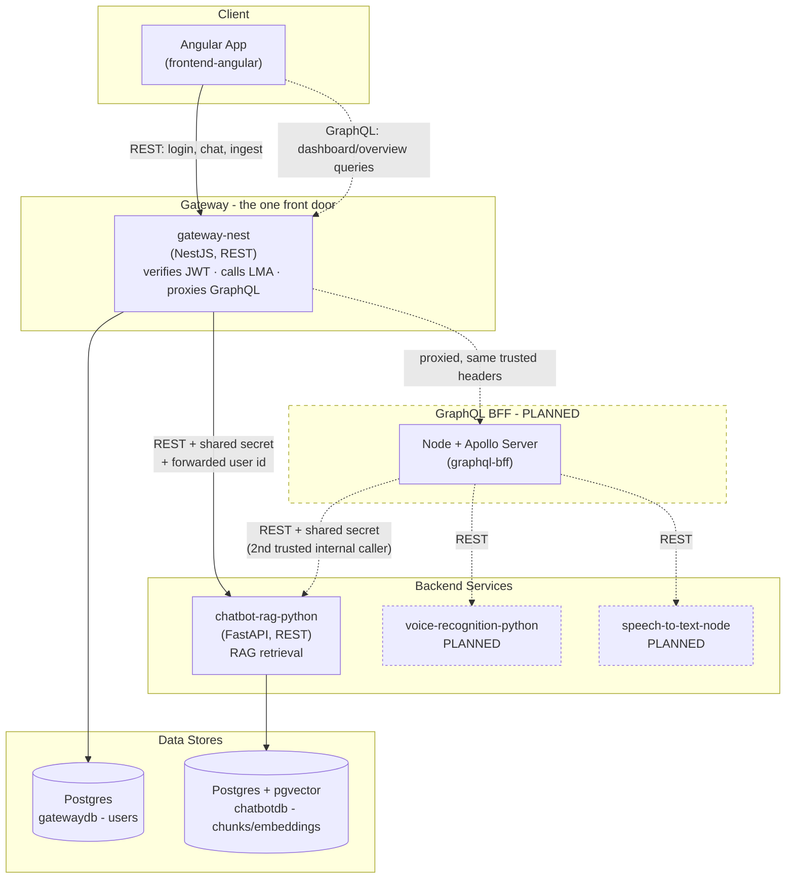

# Architecture

How the services in this repo talk to each other today, and how the
planned GraphQL BFF layer fits in once it's built.

## Two call patterns, side by side

This system intentionally uses **two different patterns** for two
different kinds of client needs, not one pattern for everything:

- **Direct REST** (exists today) - for single-purpose actions: log in,
  send a chat message, ingest a document. Angular calls `gateway-nest`
  directly; `gateway-nest` calls the Python service it needs. Fast,
  simple, one clear owner per request.
- **GraphQL BFF** (planned) - for read-heavy views that need data
  *composed* from multiple services at once, e.g. a dashboard overview
  showing document counts, recent chat activity, and voice transcription
  history together. Angular sends one GraphQL query; the BFF fans out to
  whichever services hold the pieces and returns one combined response.

Nothing about the REST paths changes when the GraphQL layer is added -
it sits *behind the same gateway*, not beside it as a second front door.
See "Where the BFF sits" below for why that distinction is deliberate,
not just phrasing.

## Diagram



Solid arrows = built and working today. Dashed arrows/boxes = planned.

## Where the BFF sits

Two things are easy to conflate here, so this is explicit about both -
the earlier sketch of this diagram had `graphql-bff` as a second front
door the Angular app talked to directly, which quietly duplicated
`gateway-nest`'s auth responsibility. That's not the plan anymore.

**Every client has exactly one front door: `gateway-nest`.** Whether a
request is a REST action or a GraphQL aggregated read, it goes to
`gateway-nest` first - `gateway-nest` stays the only thing that verifies
a JWT and the only thing that ever calls LMA (see
`PROJECT-Structure-diagram.md` §1). GraphQL requests get proxied
straight through to `graphql-bff`, carrying the same
`X-User-Id`/`X-User-Role`/`X-Subscription-Tier` headers `gateway-nest`
already forwards to every REST-called microservice. `graphql-bff` never
independently verifies a token, the same way `chatbot-rag-python` never
does.

**`graphql-bff` fans out directly to microservices**, not back through
`gateway-nest` per field. Deliberate, not a shortcut: bouncing every
fanned-out call back through `gateway-nest` would mean a single
dashboard query touching N services pays N round trips through the
gateway *in addition to* N calls to the services themselves - calling
services directly cuts that in half.

**Consequence, stated plainly:** `graphql-bff` becomes a *second*
service trusted with the internal-key secret, alongside `gateway-nest`.
Nothing about `chatbot-rag-python`'s `verify_internal_request`-style
check has to change to support this - it only checks that a caller
holds the shared secret, never which internal service is holding it.
Still just two trusted internal callers, not an ever-growing list -
worth keeping it that way rather than letting other services start
calling each other directly too.

**One rule that doesn't bend as more services get composed here:**
`graphql-bff` still goes through each microservice's own REST API - it
never reaches into another service's Postgres directly, even though
it's "internal." Same "each service owns its data, one clear owner per
request" rule the REST paths already follow; the aggregation layer
doesn't get an exception to it.

**Deliberately not doing yet:** a single hand-written schema mapping
every backend service (the `RESTDataSource` approach below) is fine to
start with, but stops scaling gracefully once enough services are
composed into it that one schema file becomes a maintenance bottleneck
owned by nobody in particular. **Apollo Federation** - each microservice
publishing its own small subgraph, a federation gateway composing them
- is the answer if that specific pain actually shows up. Not worth
building toward preemptively.

## Chat responses: semantic answers vs. structured queries

Not every question a user asks the chatbot is the same *kind* of
question, and `chatbot-rag-python` needs to treat them differently:

- **Semantic questions** ("do we have data from CompanyX?") - answered
  via vector similarity search over chunk embeddings in `chatbotdb`,
  returned as a natural-language reply.
- **Structured queries** ("give me the latest entries", "compare X and
  Y") - answered via a plain relational query against metadata stored
  alongside each chunk at ingestion time (source company, ingested date,
  document type, etc.) - **not** a vector search. Forcing this kind of
  request through similarity search would return semantically-similar
  but factually-wrong results instead of an accurate list.

**Routing between the two (PLANNED):** rule-based to start - simple
keyword/pattern matching (e.g. "latest", "list", "compare" -> structured
query path; everything else -> semantic path). No LLM dependency needed
for this decision yet. This can later evolve into LLM-driven intent
classification/function calling if rule-based matching proves too
rigid - deliberately deferred, since it would mean committing to an LLM
provider (OpenAI/Anthropic/local) earlier than necessary.

**Response shape:** the reply needs to carry more than text so Angular
knows *how* to render it, not just what to say:

```json
{
  "reply": "Here are the 5 most recent entries.",
  "type": "table",
  "data": {
    "columns": ["company", "ingestedAt", "chunks"],
    "rows": [{ "company": "CompanyX", "ingestedAt": "2026-07-20", "chunks": 42 }]
  },
  "suggestions": [
    { "label": "View as chart", "type": "chart" },
    { "label": "Compare with last month", "type": "comparison" }
  ]
}
```

- `type` is drawn from a **predefined, extensible enum** - not a
  free-form string. Starting set: `text | table | chart | list |
  comparison`. Add more as real use cases show up, rather than
  designing every possible type upfront.
- `suggestions` lets the bot proactively offer follow-up views/actions
  (e.g. "View as chart") instead of the user having to guess what's
  possible.
- `chatbot-rag-python` is the source of truth for which `type` values
  exist; `frontend-angular` needs a matching TypeScript union to switch
  on. Same "keep two languages in sync manually" situation already true
  of the shared internal-API secret (see below) - no compiler check
  across the language boundary, has to be kept in sync by hand.

## Why the BFF doesn't replace the REST paths

Migrating `login`/`chat`/`ingest` to GraphQL would add a schema, a
resolver layer, and a new client library (Apollo Client) for operations
that are already simple, single-service, and imperative - no
over-fetching problem to solve, no multiple clients to serve differently.
The BFF earns its complexity specifically where **composition across
services** is the actual problem: one Angular dashboard query, several
backend sources, assembled server-side instead of the frontend making N
separate REST calls and stitching them together itself.

## How the BFF's resolvers will call REST services

Each GraphQL resolver in `graphql-bff` needs to fetch data from a REST
service (`gateway-nest`, `chatbot-rag-python`, etc.) - the idiomatic way
to do that in Apollo Server is `RESTDataSource`, not hand-rolled
`fetch`/`axios` calls inside resolvers.

`RESTDataSource` is a base class each service's data-fetching logic
extends (e.g. `GatewayAPI extends RESTDataSource`, `ChatbotAPI extends
RESTDataSource`). It gives you:

- A consistent place to set the base URL, headers (auth, the internal
  shared-secret pattern already used between `gateway-nest` and
  `chatbot-rag-python`), and error handling for one backend service.
- **Automatic request deduplication** - if two different resolvers
  resolving the same GraphQL query both ask for the same REST resource,
  it's only fetched once.
- Built-in response caching respecting the REST API's own `Cache-Control`
  headers, without extra code.

Resolvers then depend on these data source classes instead of talking to
`fetch` directly - keeping "how do I reach this REST service" in one
place per service, separate from "how do I shape this GraphQL field."

## Open questions / TODO

Decisions deliberately deferred until there's a real need to make them:

- **Dashboard aggregation query design.** Once the frontend dashboard
  needs data from multiple services at once (documents ingested, chat
  activity, voice/STT history), decide:
  - Which specific fields the dashboard overview actually needs from
    each service (drives the GraphQL schema - ties to the Stat/KPI
    Cards frontend component).
  - How the root resolver composes them - one query fanning out via
    `RESTDataSource` to `gateway-nest` + `chatbot-rag-python` + the
    future voice/STT services.
  - Partial-failure behavior - if one fanned-out service is slow or
    down while assembling the combined response, does the query return
    partial data with a per-field error, or fail the whole request?

## Services in this repo

| Service | Role | Status |
|---|---|---|
| `frontend-angular` | Angular + PrimeNG UI | In progress |
| `gateway-nest` | Auth, session, REST proxy to Python services | In progress |
| `chatbot-rag-python` | RAG retrieval over ingested documents (pgvector) | In progress |
| `register-form-angular` | Standalone Angular SPA — multi-step registration, talks to LMA directly (see `PROJECT-Structure-diagram.md` section 3) | In progress |
| `lma-mock-nest` | NestJS — local in-memory simulator for the 3rd-party LMA's registration endpoints, standing in until the real LMA sandbox is wired up | In progress |
| `voice-recognition-python` | Voice recognition | Planned |
| `speech-to-text-node` | Speech-to-text | Planned |
| `graphql-bff` | Node + Apollo aggregation layer for cross-service reads | Planned |
