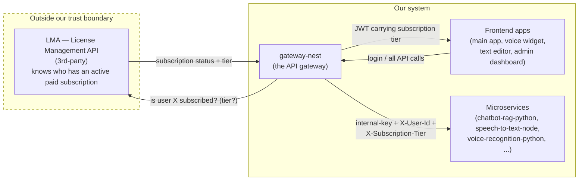
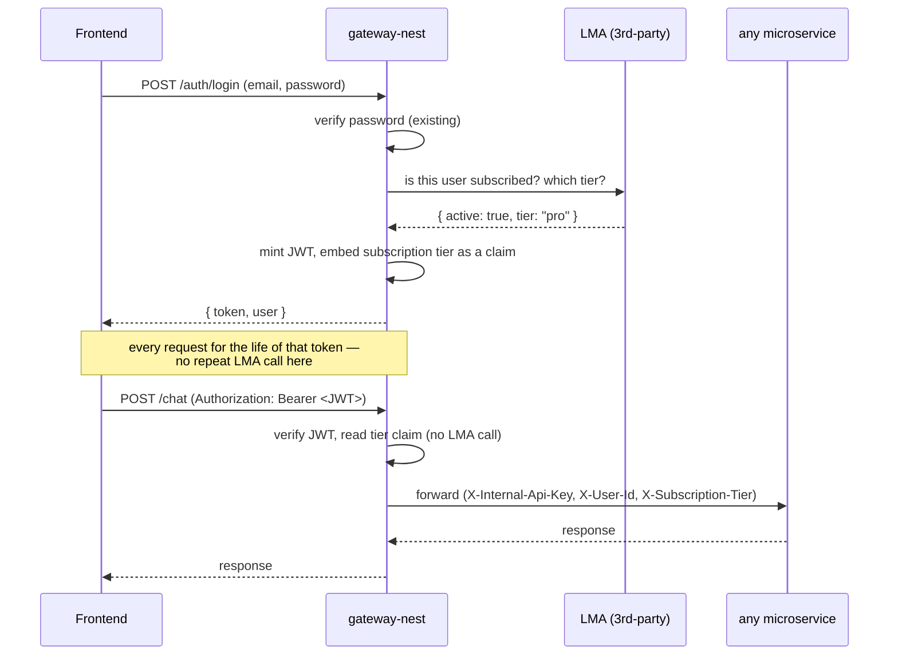
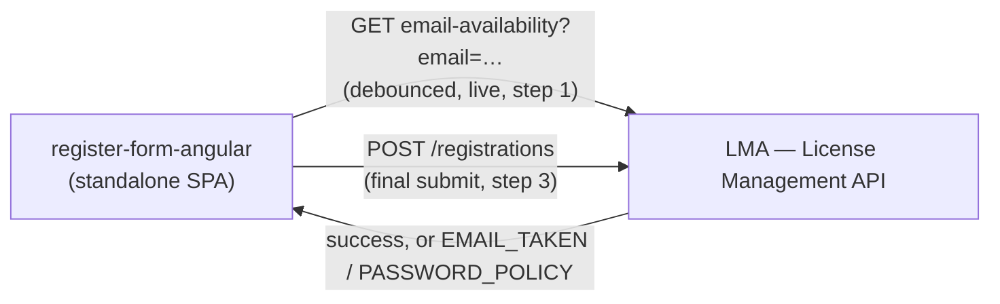
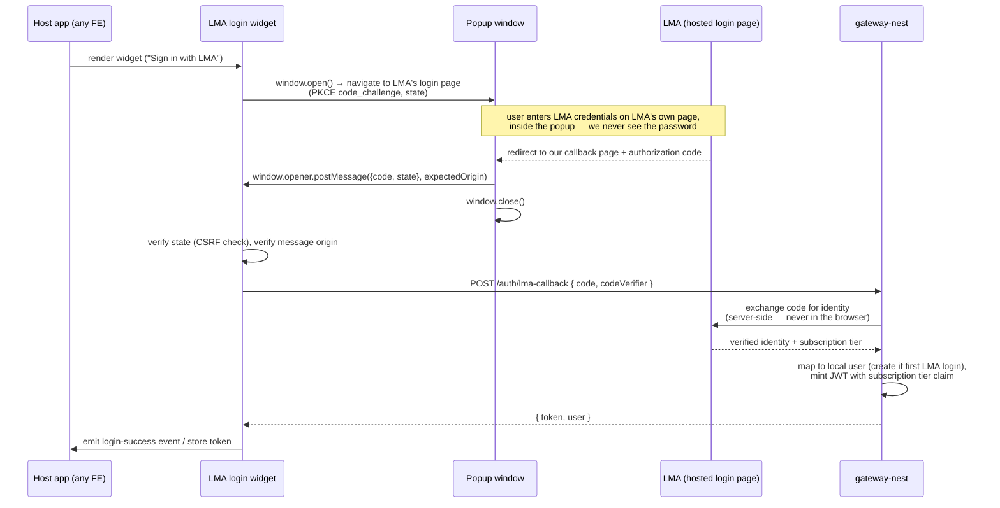
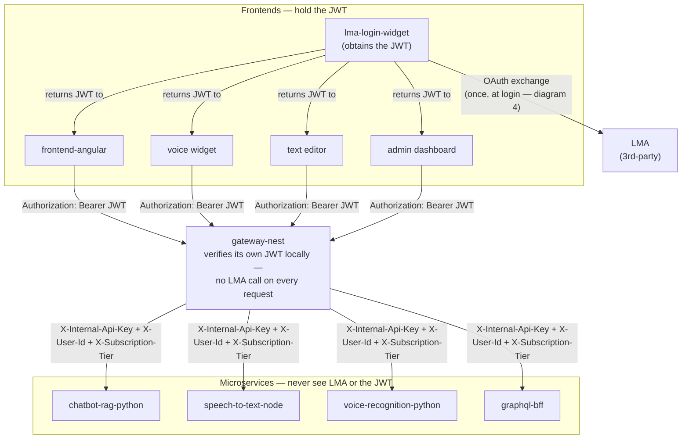

# Project Structure Diagrams

Working diagrams for how services fit together, built up incrementally.
Pairs with [`ARCHITECTURE.md`](./ARCHITECTURE.md) (the narrative/decisions)
and [`INSTRUCTIONS.md`](./INSTRUCTIONS.md) (how to run things) — this file
is just the pictures.

**Naming note:** "LMA" below = **License Management API**, the 3rd-party
subscription provider. Not to be confused with "LLM" (the Azure OpenAI
summarization feature) used elsewhere in this project — different things,
deliberately different acronyms here to avoid mixing them up.

## 1. LMA ↔ gateway-nest

The core question this diagram answers: **who talks to the 3rd-party LMA,
and how often?** Everything else (frontends, other microservices)
authenticates against `gateway-nest`, never against LMA directly —
`gateway-nest` is the single integration point, the same "one clear
owner per request" pattern `ARCHITECTURE.md` already uses for the
gateway-to-chatbot call.

**Why only `gateway-nest` calls LMA:** it's a paid 3rd-party API — every
extra integration point is another rate-limit consumer, another place
holding LMA credentials, and another place that breaks if LMA's contract
changes. One integration point, one thing to maintain.

**Why microservices don't verify subscriptions themselves:** same trust
model already in place for `X-Internal-Api-Key`/`X-User-Id` between
`gateway-nest` and `chatbot-rag-python` (see `ARCHITECTURE.md`) — a
microservice trusts the header because it only ever arrives paired with
the internal shared secret, which only `gateway-nest` holds. Adding
`X-Subscription-Tier` to that same forwarded-header set extends the
existing pattern instead of inventing a second one.

## 2. When does the LMA check actually happen?

The flowchart above shows *that* `gateway-nest` checks LMA — this shows
*when*, which is the actual open design decision.

**Open question, not yet decided:** the JWT already expires after 2h
(`jwtConstants.expiresIn` in `gateway-nest`). Is that also the
subscription-recheck interval — i.e. a lapsed/cancelled subscription
only takes effect on the user's *next* login, up to 2h stale — or does a
cancellation need to lock the user out sooner? If sooner is required,
that's a different shape: either a webhook LMA pushes to `gateway-nest`
on cancellation, or a periodic background sync — both are more moving
parts than "check once at login," so worth confirming this actually
needs to be near-real-time before building it.

## 3. register-form-angular — the one deliberate exception to "gateway-only"

Registration is a **write**, not a read, and (per step 3 of the form)
carries personal/sensitive data. Unlike the check in diagram 1, nothing
about "is this data valid" requires trusting the result server-side on
our end — LMA is simply the system of record for it. So this widget
talks to LMA directly instead of through `gateway-nest`:

Same reasoning real providers use for e.g. Stripe Checkout being embedded
directly rather than proxied through your own backend — the data isn't
establishing trust in *us*, so there's nothing for `gateway-nest` to
mediate.

## 4. LMA login widget — back to gateway-mediated, and why

OAuth becomes the **only** login path (this replaces diagram 1's local
email/password flow, not a second option alongside it) — reusable as a
micro-frontend so it can be embedded in every other frontend app, not
just one host. This looks similar to diagram 3 — a widget talking to
LMA — but it is **not** the same exception, because authentication's
entire purpose is establishing trust, and only `gateway-nest` can mint
something this system actually accepts as valid (a JWT). A frontend
simply asserting "LMA said yes" isn't verifiable.

**Popup, not iframe, for the OAuth redirect itself.** Almost every real
identity provider sets `X-Frame-Options`/`frame-ancestors` on its hosted
login page specifically to block it from rendering inside an iframe —
that's a deliberate anti-clickjacking protection (an iframed login page
is exactly the "hidden iframe capturing credentials" pattern those
headers exist to stop), not an oversight LMA is likely to have skipped.
A popup is its own top-level browsing context, so that restriction
doesn't apply to it — same "doesn't feel like leaving the host app" UX,
but it actually loads:

**Why the code exchange can't happen in the widget:** even with PKCE (no
client secret needed), the exchange step is the moment "this login
attempt succeeded" becomes a fact the rest of the system trusts. That
decision has to be made by the one thing everything else already trusts
— `gateway-nest` — not by a browser tab a tampered client could
manipulate into skipping straight to "success."

This also folds into diagram 1's outcome rather than discarding it: the
subscription-tier check diagram 1 showed happening once at login now
arrives bundled with LMA's identity response in the exchange step above.
Login still converges on the same result — a `gateway-nest` JWT carrying
a subscription tier claim — just sourced from LMA now instead of a local
password check.

**Packaging: Angular Elements / Web Component.** Built with
`@angular/elements` and registered as a custom element
(`<lma-login-widget>`) — framework-agnostic, so any host app (Angular,
React, plain HTML) can embed it with a script tag and an element, not
just Angular hosts. This is the widget's own outer shell; the OAuth step
inside it is still the separate popup from the sequence diagram above,
not related to how the widget itself gets embedded.

---

## 5. Who authenticates against what — the whole system at once

Diagrams 1 and 4 each showed one flow in isolation. This zooms out to
the rule that makes the whole system trustable without every service
reinventing it: **`gateway-nest` is the only thing that ever talks to
LMA for authentication, and the only thing that ever verifies a
token.** Everything else either holds a `gateway-nest` JWT, or trusts a
header `gateway-nest` forwarded.

Two consequences worth being explicit about:

- **New microservices get auth for free.** `speech-to-text-node`,
  `voice-recognition-python`, and `graphql-bff` don't need their own
  LMA integration, JWT verification, or even awareness that OAuth
  exists — they implement the same `verify_internal_request`-style
  header check `chatbot-rag-python` already has, and that's the whole
  job.
- **New frontends get auth by embedding the widget, not by re-solving
  login.** The voice widget, text editor, and admin dashboard each drop
  in `<lma-login-widget>`, get a JWT back, and use the same
  `auth-interceptor.ts` pattern `frontend-angular` already has. None of
  them talk to LMA.

**The one thing this diagram doesn't resolve** — carried over from
diagram 1's open question, now more pressing since it's the shape for
the *whole* system, not just one flow: is a `gateway-nest`-verified JWT
good enough for its full lifetime (currently 2h), or does a
cancelled/downgraded LMA subscription need to invalidate access sooner
than that? Still deferred, but worth deciding before this goes further,
since it determines whether `gateway-nest` ever needs a second,
lower-latency channel back to LMA (webhook) beyond the once-at-login
exchange this whole diagram assumes.

---

*Next: whether admin-dashboard permissions ride the same JWT claim or
need their own, once that widget's shape is decided.*
